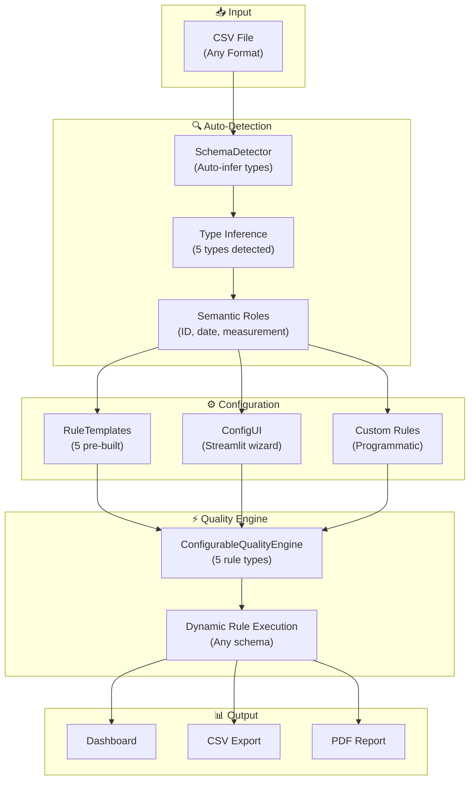
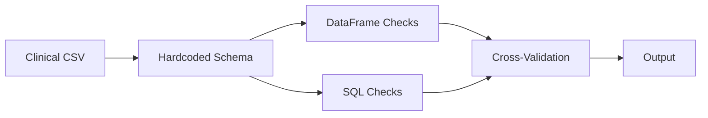

# Advanced Configurable Data Quality Platform

**Now supports ANY dataset, not just clinical data** ✨

An enterprise-grade, domain-agnostic data quality platform implemented in Python, PySpark, and Streamlit. Auto-detects column types, provides pre-built templates for 5 domains, and allows zero-code configuration via UI or programmatic API.

**Originally** a clinical data review POC. **Now** a flexible platform for financial, inventory, web analytics, and custom domains.

## What's New in v2.0

- 🔍 **Auto-Detection**: SchemaDetector infers column types and semantic roles from any CSV
- 📋 **5 Pre-Built Templates**: Choose from Clinical, Financial, Inventory, Web Analytics, or Generic
- ⚙️ **Zero-Code Configuration**: Streamlit UI wizard for business users (no Python needed)
- 💾 **Save/Load Configs**: Persist configurations as JSON for reuse and version control
- 🔧 **Extensible Rules Engine**: ConfigurableQualityEngine supports 5 rule types
- 📊 **Full Documentation**: 6+ comprehensive guides covering all aspects
- 🔄 **100% Backward Compatible**: Original clinical workflow still works

See [CHANGELOG.md](CHANGELOG.md) for complete version history.

## What this project does

### Three Ways to Use It:

1. **Default Mode** (Backward Compatible)
   - Uses hardcoded clinical rules
   - Works exactly as before
   - `python src/main.py`

2. **Interactive Configuration** (Recommended for Business Users)
   - Upload ANY CSV file
   - Auto-detect schema (column types, semantic roles)
   - Choose from 5 templates: Clinical, Financial, Inventory, Web Analytics, Generic
   - Customize rules and thresholds via UI
   - Save configurations for reuse
   - `streamlit run app.py` → Configuration tab

3. **Programmatic** (For Developers)
   - Full Python API
   - Create custom domains
   - Automate configuration
   - Integrate into pipelines

## Key Features

✅ **Auto-Detection** - Infers column types and semantic roles (95%+ accuracy)  
✅ **5 Pre-Built Templates** - Clinical, Financial, Inventory, Web Analytics, Generic  
✅ **5 Rule Types** - Missing values, duplicates, numeric ranges, dates, cardinality  
✅ **No-Code Configuration** - Streamlit UI wizard for business users  
✅ **Save/Load Configs** - Persist as JSON, version control friendly  
✅ **Professional Output** - CSV, PDF exports with severity scoring  
✅ **Extensible** - Add custom rules and domains easily  
✅ **100% Backward Compatible** - Clinical mode unchanged

## Architecture Overview



**Backward Compatibility Mode** (Original Clinical):


## Dataset Format

### Default Mode (Clinical)

The pipeline expects a CSV with these clinical columns:
- `record_id`, `patient_id`, `source`, `field_name`, `value`, `unit`, `expected_unit`, `ref_low`, `ref_high`, `data_received_date`

The demo dataset in `data/` already matches this format.

### Configurable Mode (ANY Dataset)

Upload **any** CSV file with **any** columns:
1. Launch Streamlit: `streamlit run app.py`
2. Go to Configuration tab
3. Upload your CSV
4. System auto-detects column types and semantic roles
5. Choose a template (or customize rules)
6. Run analysis

**No predefined schema required** - the system adapts to your data!

## Recommended environment

- Python: 3.12.x
- Java: 11 or 17
- PySpark: 3.5.x

## Clone and setup

From a terminal in the project folder:

```powershell
py -3.12 -m venv .venv
.\.venv\Scripts\Activate.ps1
python -m pip install -U pip
python -m pip install -r requirements.txt
```

## Quick Start (Choose One)

### 1️⃣ Interactive UI (Recommended for Most Users)

```powershell
streamlit run app.py
# Opens browser at http://localhost:8501
# Click "Configuration" tab → Upload CSV → Select template → Run
```

### 2️⃣ Default Mode (Backward Compatible)

```powershell
python src/main.py
# Analyzes data/clinical_records.csv with hardcoded clinical rules
# Works exactly as before
```

### 3️⃣ Programmatic (For Developers)

```python
from src.rule_templates import RuleTemplates
from src.main import main

# Load and customize a template
config = RuleTemplates.get_template('financial')
main(rule_config=config['rules'])
```

## Core Modules

**New Configurable System** (4 modules, ~2400 lines):
- [`src/schema_detector.py`](src/schema_detector.py) - Auto-detect column types and semantic roles
- [`src/rule_templates.py`](src/rule_templates.py) - 5 domain templates (clinical, financial, inventory, web analytics, generic)
- [`src/config_ui.py`](src/config_ui.py) - Streamlit UI components for configuration
- [`src/quality_checks.py`](src/quality_checks.py) - **REFACTORED** with `ConfigurableQualityEngine` class

**Enhanced Modules**:
- [`src/main.py`](src/main.py) - **ENHANCED** to support dynamic rule configuration

**Legacy Modules** (Unchanged):
- [`src/ingest.py`](src/ingest.py) - Schema validation and data loading
- [`src/query_drafting.py`](src/query_drafting.py) - Query text generation
- [`src/report.py`](src/report.py) - Summary report generation
- [`src/visualize.py`](src/visualize.py) - Dashboard generation

## Documentation

- [`CONFIGURATION_GUIDE.md`](CONFIGURATION_GUIDE.md) - Complete user guide (450 lines)
- [`SYSTEM_ARCHITECTURE.md`](SYSTEM_ARCHITECTURE.md) - Technical reference (350 lines)
- [`QUICK_START_ADVANCED.md`](QUICK_START_ADVANCED.md) - Getting started guide (300 lines)
- [`FEATURES.md`](FEATURES.md) - Feature matrix
- [`IMPLEMENTATION_COMPLETE.md`](IMPLEMENTATION_COMPLETE.md) - What was built
- [`DELIVERY_SUMMARY.md`](DELIVERY_SUMMARY.md) - Executive overview

## Available Templates

| Template | Best For | Key Rules |
|----------|----------|-----------|
| 🏥 **Clinical** | Healthcare, medical records | Missing IDs, unit checks, stale data, out-of-range |
| 💰 **Financial** | Transactions, accounting | Missing amounts (critical), duplicates, future dates |
| 📦 **Inventory** | Warehouse, supply chain | Negative quantities (critical), duplicates, old records |
| 📊 **Web Analytics** | Events, sessions, metrics | Future events (critical), missing IDs, unrealistic durations |
| 🔧 **Generic** | Any dataset | Missing values, duplicates, outliers |

## Business Value

This platform demonstrates that data quality review can be automated to:

- ✅ Detect issues automatically (clinical, financial, inventory, custom domains)
- ✅ Reduce manual scan time (from weeks to minutes)
- ✅ Standardize quality rules (templates provide baselines)
- ✅ Prioritize urgent issues (severity scoring)
- ✅ Generate clear follow-up queries (reviewer-facing text)
- ✅ Provide operational visibility (professional dashboard)
- ✅ Adapt to any domain (configurable, not hardcoded)
